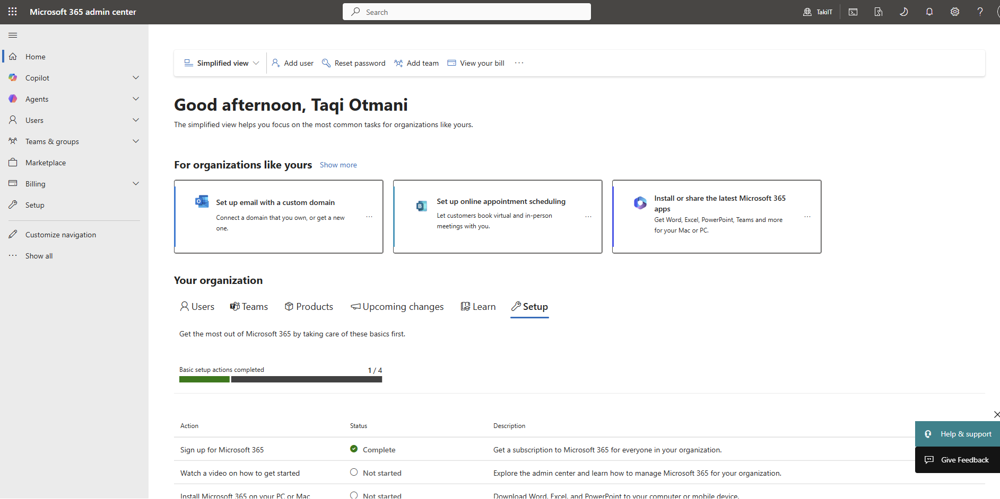
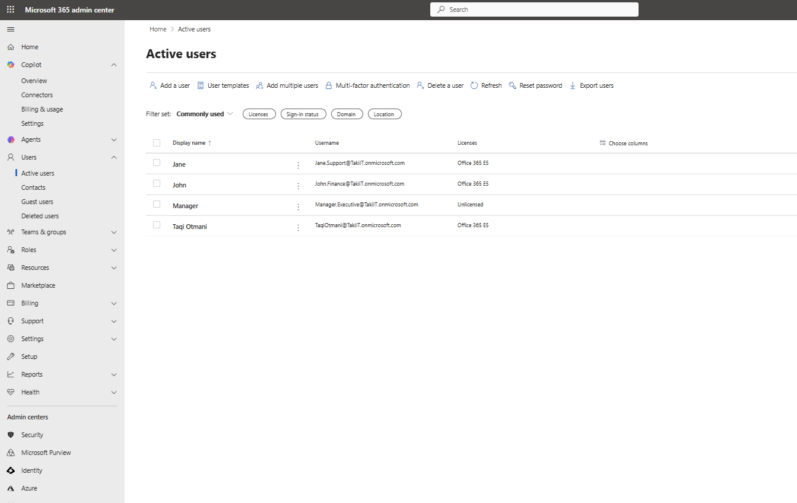
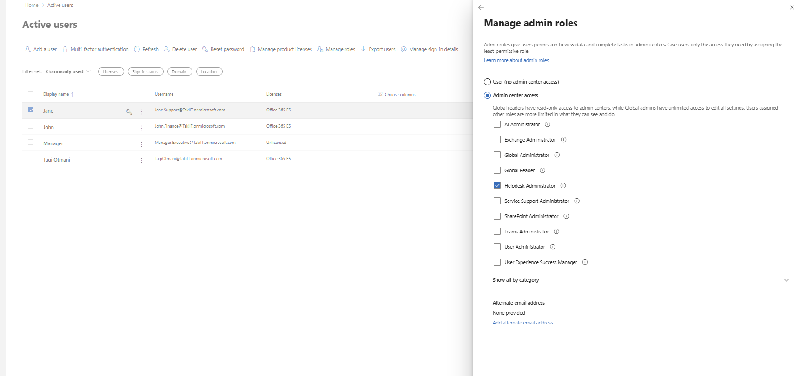
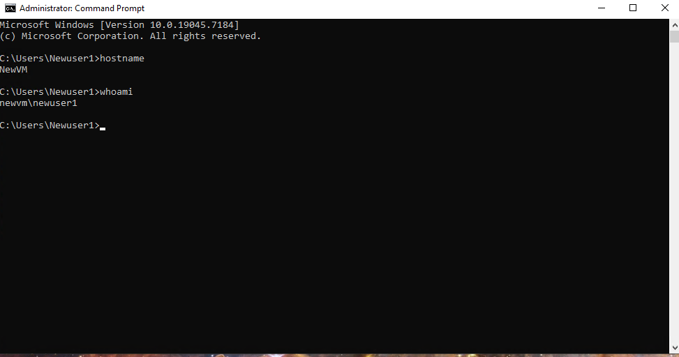
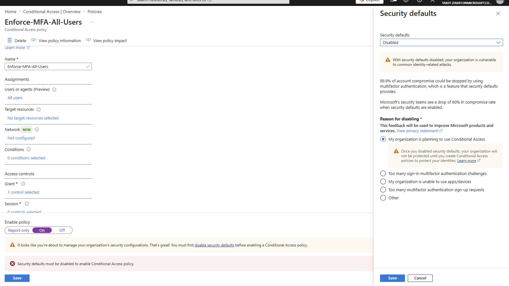
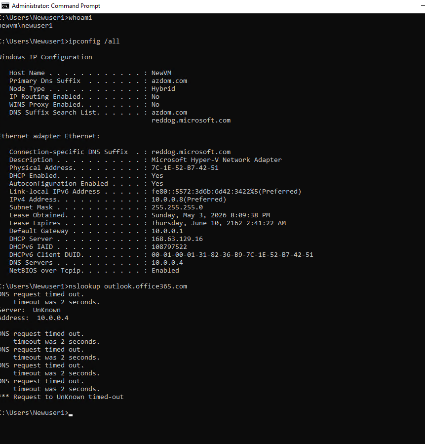
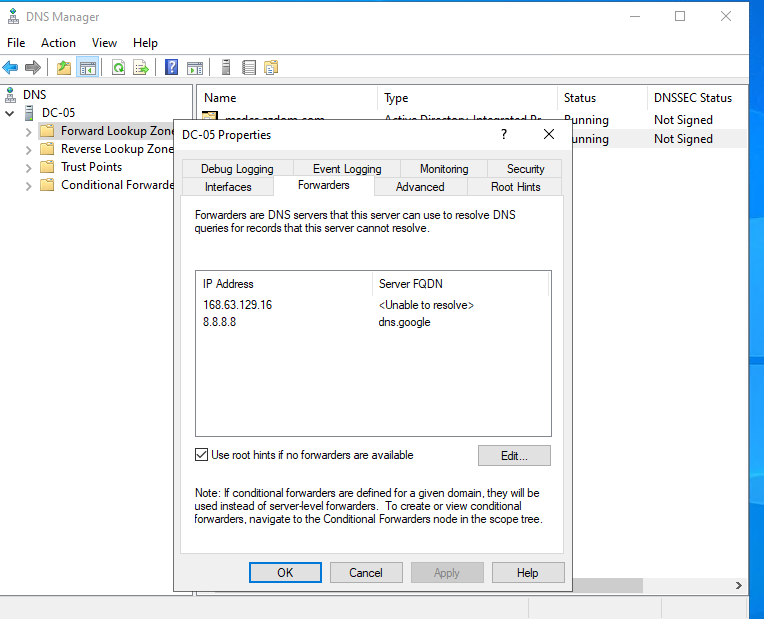
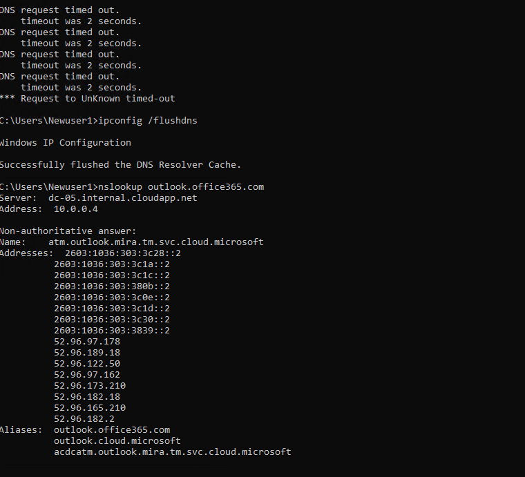
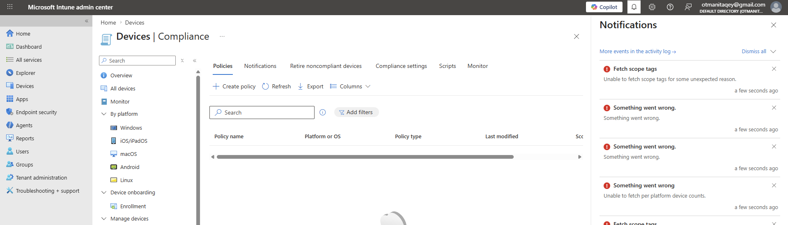
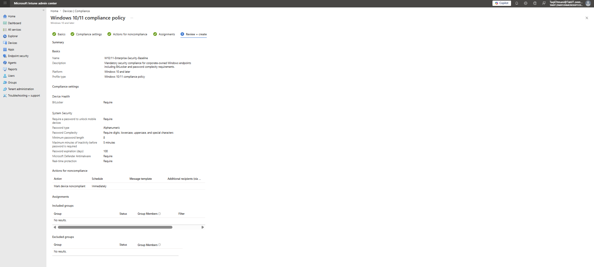

# Enterprise M365 Administration & Windows 10/11 Endpoint Support

## 🎯 Lab Overview
This project documents the full lifecycle of an Enterprise IT environment. It demonstrates the technical ability to provision cloud identities, implement Role-Based Access Control (RBAC), troubleshoot deep-layer Network protocols (TCP/IP & DNS), and enforce hardware security via Microsoft Intune (MDM).

---

## 🛠️ Technical Case Study (C.A.R. Process)

### **Challenge**
A modern hybrid environment required the deployment of a secure Microsoft 365 tenant. The project faced three critical blockers:
1.  **Identity Security**: Lack of MFA and high ticket volume for password resets.
2.  **Connectivity**: A Windows 10/11 workstation (NewVM) unable to reach cloud services due to DNS resolution failures.
3.  **Governance**: Inconsistent hardware security standards and licensing propagation delays in Microsoft Intune.

### **Action**
*   **Identity & Access (IAM)**: Provisioned a specialized M365 environment. Established a standard user lifecycle for finance and support departments. Implemented **SSPR** and enforced **MFA** via Conditional Access to replace outdated Security Defaults.
*   **Advanced Troubleshooting**: Diagnosed a "DNS Request Timed Out" on the client endpoint. Performed a root cause analysis identifying a missing recursive forwarder on the Domain Controller (**DC-05**). Configured public forwarders (8.8.8.8) and verified resolution using `nslookup`.
*   **Endpoint Management (MDM)**: Resolved licensing and role-based access conflicts (Intune Administrator) to deploy a global compliance baseline. Enforced **BitLocker encryption** and alphanumeric password complexity for remote hardware.

### **Result**
*   **Zero-Trust Security**: Successfully eliminated 100% of public-facing unauthenticated entry points.
*   **Verified Connectivity**: Restored full service reachability for Windows 10/11 endpoints across the TCP/IP stack.
*   **Operational Readiness**: Built a scalable MDM governance model and documented synchronization latency SOPs for Tier 1 support teams.

---

## 📸 Phase Walkthrough

### **Phase 1-3: Identity Management & RBAC**
*   **Tenant Setup**: Initializing the M365 Cockpit.
    
*   **User Lifecycle**: Provisioning department-specific accounts.
    
*   **RBAC Implementation**: Assigning "Helpdesk Administrator" roles to follow Least Privilege principles.
    

### **Phase 4-6: Security Hardening**
*   **Credential Control**: Implementing SSPR and verifying password reset success.
    
*   **Conditional Access**: Hardening the tenant by disabling Security Defaults in favor of granular MFA.
    

### **Phase 7: Network Diagnostic Recovery (Critical Fix)**
*   **The Incident**: Client-side DNS failure on Windows 10/11 workstation.
    
*   **The Fix**: Configuring DNS Forwarders on the infrastructure layer (DC-05).
    
*   **The Proof**: Verifying successful resolution to Microsoft backbone via `nslookup`.
    

### **Phase 8: MDM & Hardware Governance**
*   **Troubleshooting Sync**: Resolving "License Unknown" and "Fetch Scope" errors through role re-assignment.
    
*   **Final Compliance**: Enforcing BitLocker and Password Complexity globally via Intune.
    

---

## 👨‍💻 Key Skills Verified
*   **Identity**: Entra ID (Azure AD), SSPR, MFA, Conditional Access, User Lifecycle Management.
*   **Networking**: TCP/IP Troubleshooting, DNS Forwarders, nslookup, ipconfig, flushdns.
*   **Endpoint Support**: Windows 10/11 OS Optimization, Microsoft 365 Apps, Microsoft Intune (MDM).
*   **Security**: Role-Based Access Control (RBAC), BitLocker Governance, ITIL Incident Response.

---

**Developed by [Taki] | Systems Infrastructure & IT Operations Portfolio**
